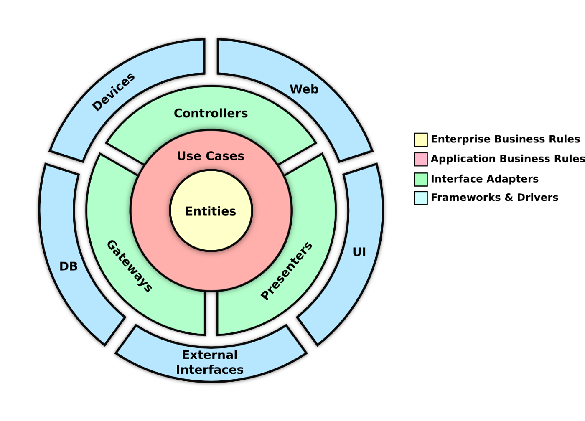
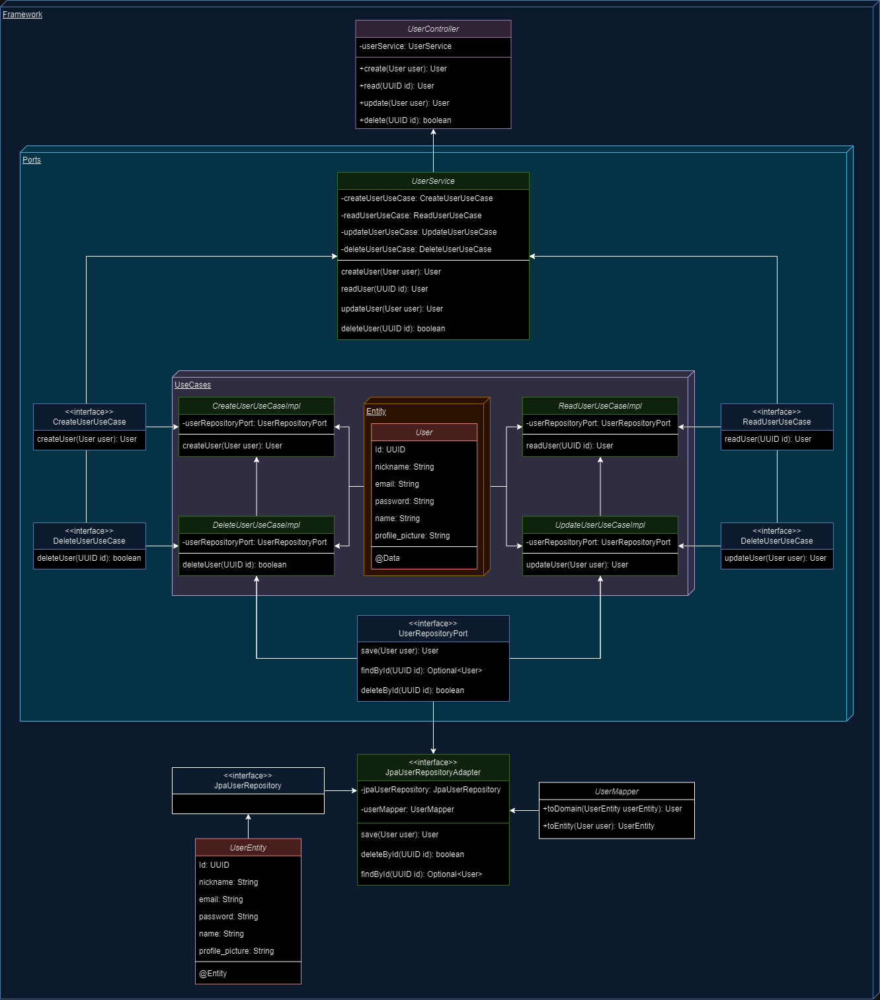

# SCRUM-ARCH-HEXAGONAL
O SCRUM-API é uma API para gerenciamento de projetos baseada no framework Spring Boot e utilizando um banco de dados PostgreSQL. Essa API foi desenvolvida para auxiliar na gestão de projetos seguindo a metodologia SCRUM, permitindo o controle de usuários, projetos, sprints, backlog e tarefas de forma eficiente. Durante o desenvolvimento, o principal foco e a prática da arquitetura limpa no código, separando entre camadas assim desacoplando as regras de negócio do framework.

## Futuras funcionalidades
- [X] Criar CRUD para usuários
- [ ] Tratamento de exceções
- [ ] Criar um sistema de login e autenticação
- [ ] Criar feat projetos
- [ ] Criar relação entre usuário e projeto (ManyToMany)
- [ ] Endpoints de adicionar/remover usuário do projeto

## Diagrama de relacionamentos
O diagrama abaixo mostra a a
